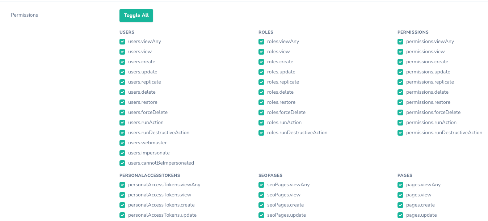
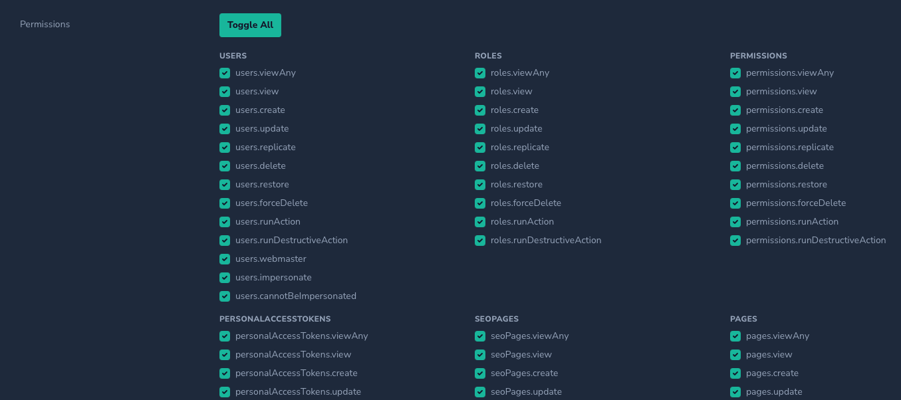
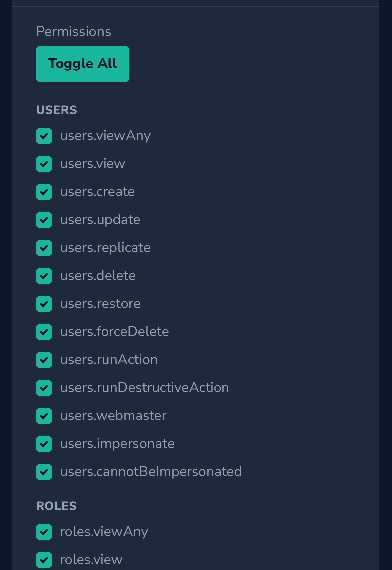
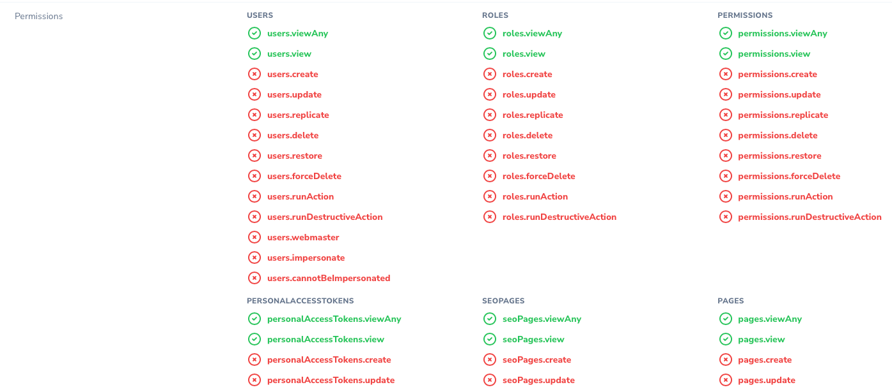
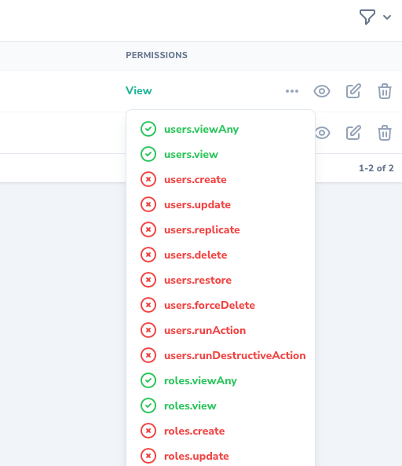

# Nova Boolean Group

[](https://packagist.org/packages/stepanenko3/nova-boolean-group-field)
[](https://packagist.org/packages/stepanenko3/nova-boolean-group-field)
[](https://packagist.org/packages/stepanenko3/nova-boolean-group-field)



## Description

Extended BooleanGroup Field for Laravel Nova

## Features

- Grouped by prefix
- Support dotted options
- Support multidimensional arrays
- Toggle all checkboxes
- Toggle group of checkboxes

## Requirements

- `php: >=8.0`
- `laravel/nova: ^4.0`

## Installation

```bash
# Install the package
composer require stepanenko3/nova-boolean-group-field
```

## Usage

Add the use declaration to your resource and use the fields:

```php
use Stepanenko3\NovaBooleanGroup\BooleanGroup;
...

BooleanGroup::make('Permissions', 'permissions'),

BooleanGroup::make('Layouts', 'layouts')->options([
    'value1' => 'Value1',
    'value2' => 'Value2',
    'value3.value1' => 'Value3.1',
    'value3.value2' => 'Value3.2',
    'value4.value1' => 'Value4.1',
    'value4.value2' => 'Value4.2',
    'value5' => [
        'value1' => 'Value5.1',
        'value2' => 'Value5.2',
        'value53' => [
            'value1' => 'Value5.3.1',
            'value2' => 'Value5.3.2',
        ],
    ],
]),

BooleanGroup::make('Permissions', 'permissions')
    ->hideFalseValues(),

BooleanGroup::make('Permissions', 'permissions')
    ->hideTrueValues(),
```

## Screenshots






## Credits

- [Artem Stepanenko](https://github.com/stepanenko3)

## Contributing

Thank you for considering contributing to this package! Please create a pull request with your contributions with detailed explanation of the changes you are proposing.

## License

This package is open-sourced software licensed under the [MIT license](LICENSE.md).
